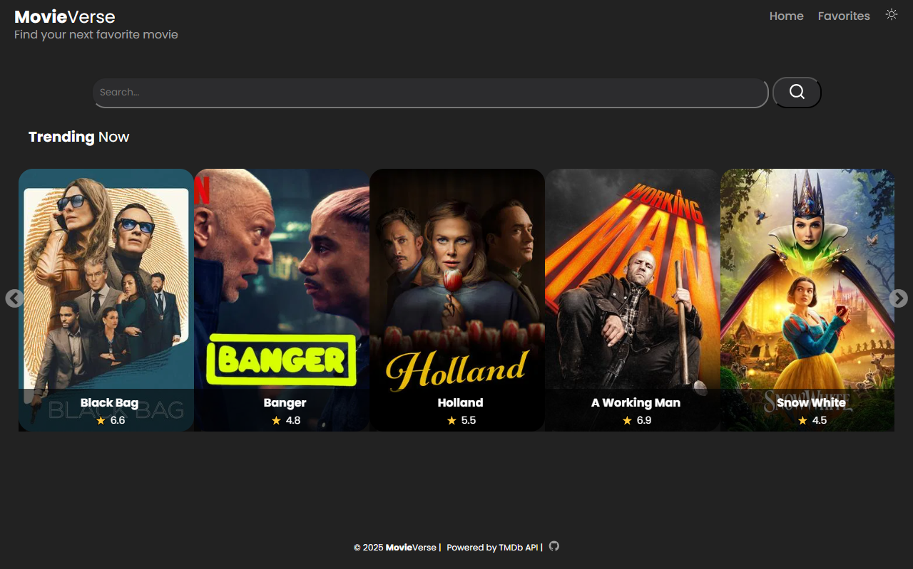
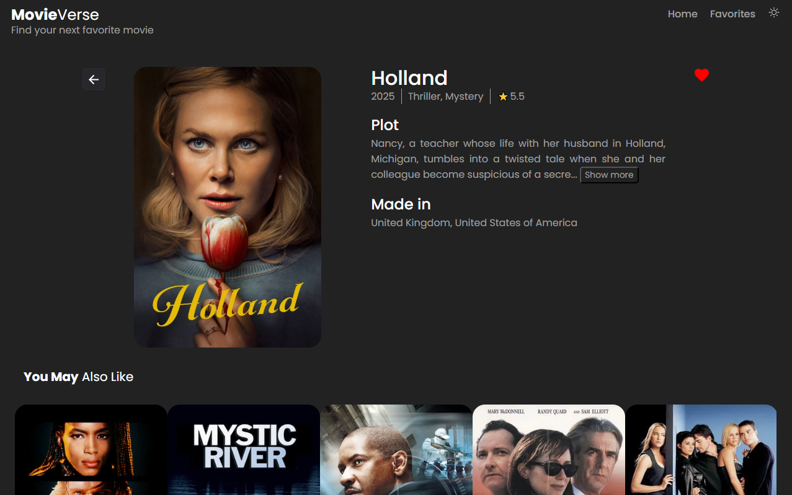
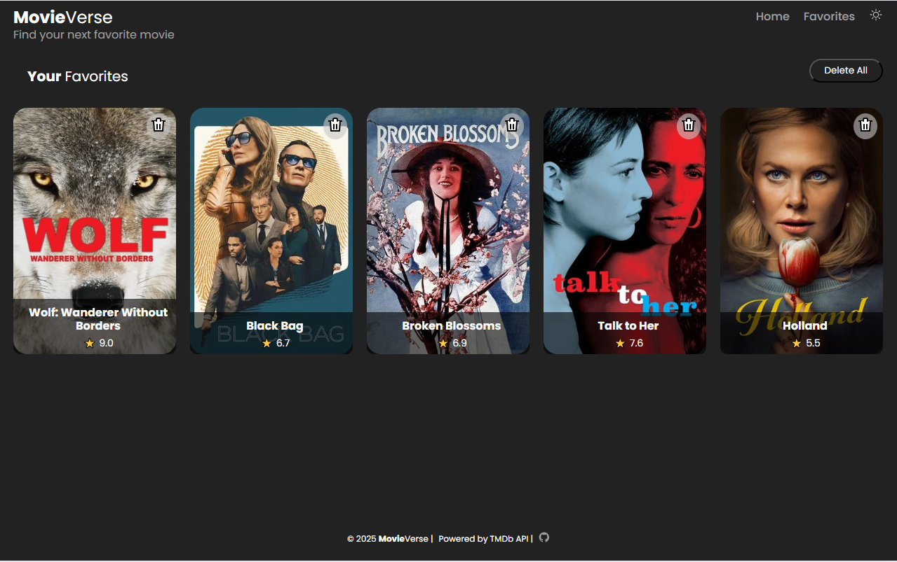
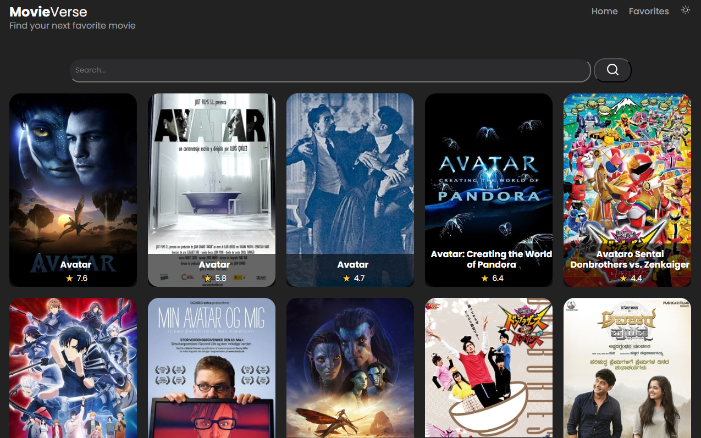
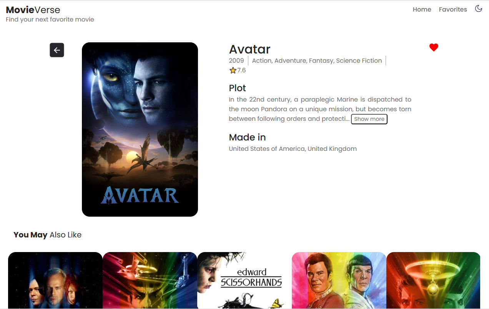

# 🎬 MovieVerse  

**MovieVerse** is a movie search application that allows users to discover films, view detailed information, and save favorites. The app integrates with a movie database API and supports **local storage** for saving favorite movies and theme preferences.

---

## Features  

- 🔍 **Movie Search** – Enter a title to find movies from a vast database.  
- ⭐ **Favorites** – Save movies to your favorites list using **local storage**.  
- 🎭 **Movie Details** – Get comprehensive information, including rating, genre, and synopsis.  
- 🎞️ **Trending Movies** – Browse the most popular and trending movies.  
- 🎥 **Movie Recommendations** – Get movie suggestions based on a selected film.  
- 🌗 **Theme Persistence** – The app remembers your selected theme using **local storage**.

---

## Screenshot  

  
  
  
  
  

---

## Built With  

 
 
 
 
  

---

## 🎯 Project Purpose  

This project was developed to practice:  

- 🔗 **API integration** for fetching movie data.  
- ⚛️ **State management** with React hooks.  
- 🏗️ **Prop-based component rendering** for modular UI.  
- 💾 **Persistent storage** using local storage.  
- 🎥 **Implementing movie recommendations** and **trending movie lists**. 

## 📩 Contact  

If you have any questions or suggestions, feel free to reach out:  

📧 **Email**: [o.nova0804@gmail.com](mailto:o.nova0804@gmail.com)  
🔗 **LinkedIn**: [Oksana Smirnova](https://www.linkedin.com/in/oksana-smirnova-developer/)  